## Introduction

With **TIBCO Flogo®  Agentic AI and the **TIBCO Platform Model Context Protocol (MCP) Services** enterprises can now build autonomous goal driven **AI-Agents**, enabling secure, intelligent automation across CRM, order management, and communication systems.

This demo showcases how Flogo AI Agent Activity can assist you in problem determination and error handling of applications running in the TIBCO platform, as an **AI-powered Alert Agent**.

## Demo Overview

 **In this demonstration, we build an **Autonomous AI agent** using the Flogo AI Agent activity. 
 It illustrates how the MCP services of TIBCO Platform can be used as **Tools**.** And work together to connect AI models (like Claude or OpenAI model) in the Agentic context.

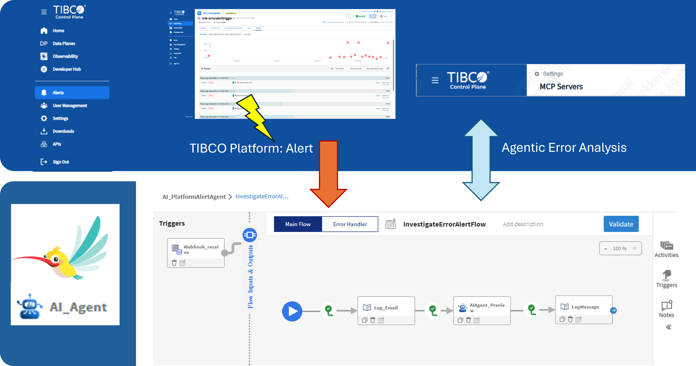

The scenario starts in TIBCO Platform, where the Alerts configuration is used to monitor error situations on Flogo applications deployed in platform. When the alert conditions are met, the TIBCO Platform will send an alert to the AI Agent for further error investigation. For communication the newly introduced Webhook support from platform version 1.17 is used to communicate to the Flogo AI Agent. 

The **TIBCO Platform MCP services** support the autonomous AI Agent to collect relevant data on the erroneous application. The AI Agent Reports back its findings in logged response.
This is done by a multi step approach fed into the user prompt of the AI Agent.

```
Perform the following steps to work to an answer:  

Step 1: From the received email. Determine the  application name and 'affected DP' data plane name that has produced the error from the alert message.

Step 2: Find the application in the 'Affected DP' data plane and determine the dataplaneid that runs this application. Retrieve the 'application name' from the alert message.

Step 3: Determine via the right tool if the 'applicationId' in the 'dataplaneId'  is a 'FLOGO', 'BWCE' or a 'BW5CE' application type.

Step 4: Determine the application runtime status of the faulty application with the 'applicationId'.

Step 5: Gather all other application information that can be found using the tools on 'applicationId' and 'data-plane-id' 

Step 6: Try to find the error in the Observability and trace information of this application with the 'applicationId' and 'data-plane-id'. 

Create a nice overview of all relevant data from the application causing the error notification. Summarize in plain text, show these details in the summary: 'Alert name', 'Alert Description', 'Event Type', 'Value', 'Timestamp', 'Affected DP', 'DataplaneId', 'Capability Type', 'Affected app', 'Runtime Status of the Affected app', 'Alert message'.
```

### TIBCO Platform events

The alerts and notifications in TIBCO Control Plane improve user visibility into system events, failures, and performance thresholds, enhancing overall operational awareness and reducing response time to critical issues.

The platform 1.17 release introduces a new Webhook receiver for alert notification. This feature allows you to integrate alert notifications with external systems using a standardized JSON payload.
This scenario uses this new functionality to communicate between the TIBCO Platform and the Flogo AI Agent.

 The Alert configuration in TIBCO Platform consist of two parts. First you need to configure the Alert Receivers, in our use case the webhook endpoint, which is the public webhook URL of the deployed AI Agent in Flogo.

>Please Note: You will only have the public webhook URL after deployment of the Flogo AI Agent and after exposing the endpoint as a public accessible endpoint. When successfully done so, you can copy the public endpoint from the deployed Flogo Application and add the Context Path of the trigger request to this.

The second part of the configuration is the definition of the Alert itself. This is done via the 
"+ Configure Alert" button in the Alerts part of the Control Plane menu. 

#### Alert Receiver definition

Via the Global Configuration settings, the Alert Receivers can be configured for email and webhook alerting.

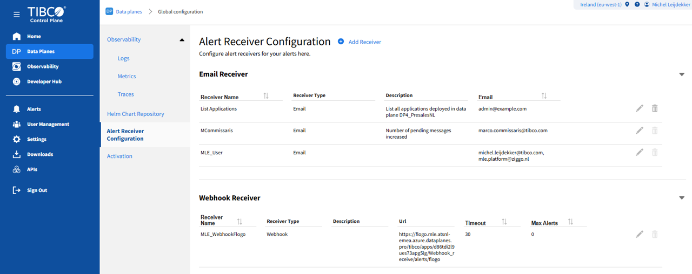

The webhook definition in this AI Agentic scenario points to the endpoint URL of the AI Agent Flogo implementation. In this case it is also running in a TIBCO Platform data plane under the Flogo capability.

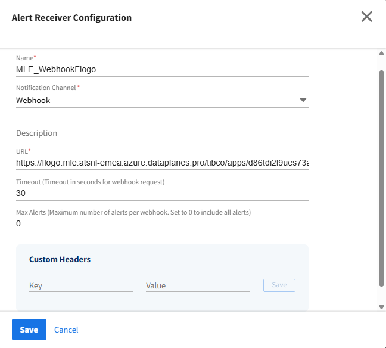

#### Alert Definition

For this AI Agentic scenario an Error Event for Flogo Applications was created with the following settings.

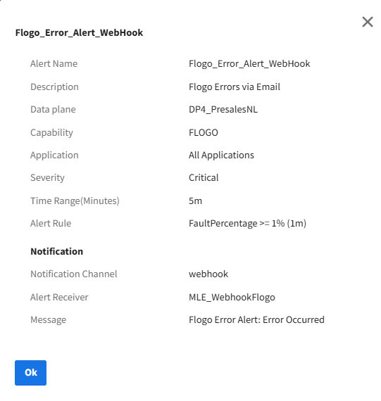

This Alert will be evaluated every 5 minutes. When the Alert Rule is evaluated to true, the alert will be sent to the configured Alert Receivers.
### TIBCO Platform MCP Servers

MCP (Model Context Protocol) is an open-source standard for connecting AI applications to external systems. TIBCO® Control Plane MCP server connects AI applications to TIBCO Control Plane. This gives AI applications the ability to process TIBCO Control Plane, data plane, and capabilities data by using natural language interactions.

The Tools provided by the TIBCO Platform MCP Servers are called by the AI Agent for collecting relevant information when reasoning and executing the AI-Prompt to investigate the received error alert. 

In the TIBCO platform these MCP Servers should be enabled in the TIBCO Control Plane -> Settings - MCP Servers. TIBCO applies an AI enable policy, where you need to opt-in for AI related services.


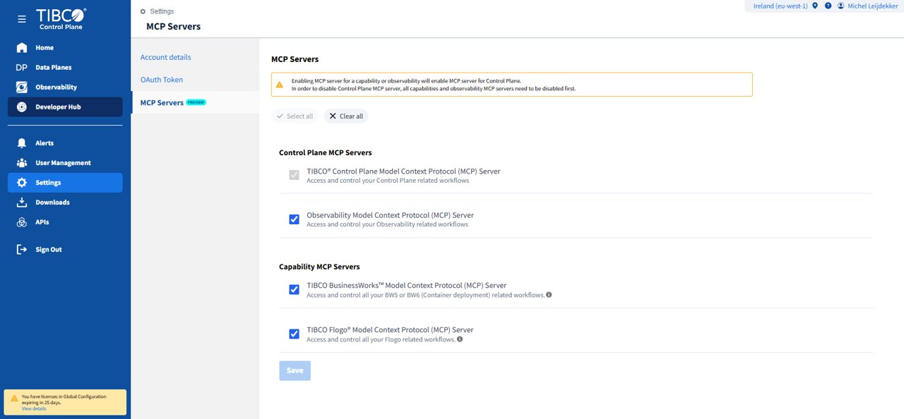

### Flogo Agentic AI

The new TIBCO Flogo® Connector for Agentic AI - Tech Preview enables developers to build and orchestrate intelligent, AI-driven agentic workflows within the Flogo ecosystem. It allows you to seamlessly combine LLM-powered decision-making with deterministic business workflows, bringing intelligence, adaptability, and context-awareness to automation flows.
  
With built-in support for LLM connections, agent triggers, agent invocation, and tool integrations, the connector empowers you to design both orchestration agents and domain-specific agents that can autonomously coordinate tasks, retrieve data, and make contextual decisions.

The core of the Agentic AI part of this Error Alert scenario is build in the Flogo flow: AI_PlatformAlertAgent, which is also available in the source folder.

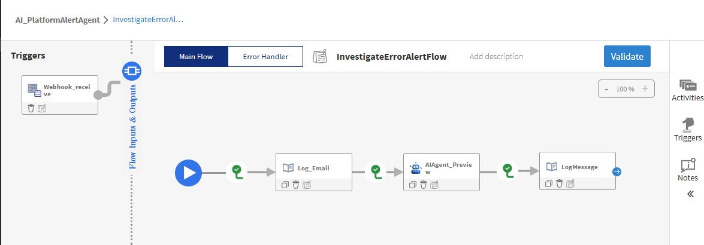

#### Connection definitions

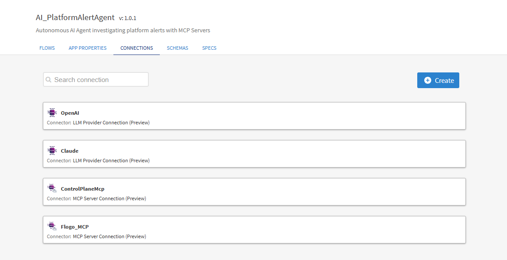

| Connection               | Connection Type         |
| ------------------------ | ----------------------- |
| Open AI                  | LLM Provider Connection |
| TIBCO® Control Plane Model Context Protocol (MCP) Server | MCP Server Connection   |
| TIBCO Flogo® Model Context Protocol (MCP) Server         | MCP Server Connection   |

##### LLM Provider Connection (Preview) 

For the reasoning of the AI Agent a connection to a LLM is needed. In this example a connection to OpenAI is configured. The authentication is done via an API Key of OpenAI.

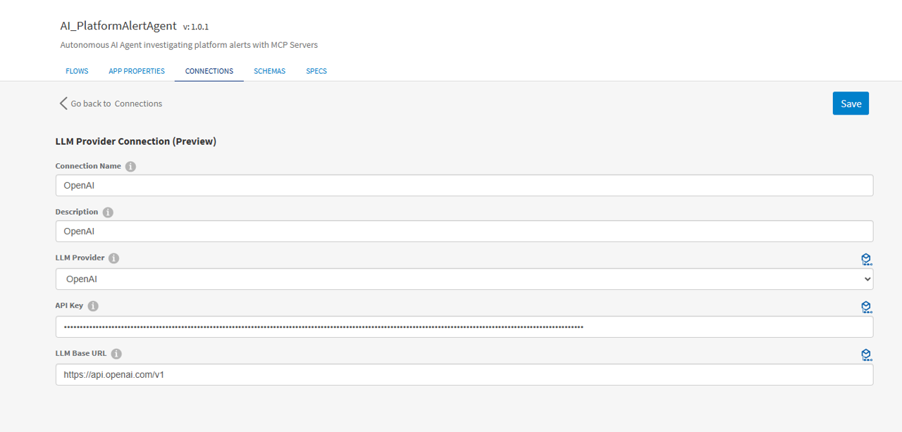

Settings for the actual AI usage are configured on the activity level of the *AI Agentic Activity*, where maximum number of tokens, iterations and temperature settings are configurable.

##### TIBCO® Control Plane Model Context Protocol (MCP) Server

The connection settings for the TIBCO Platform MCP Servers can be obtained via the [TIBCO Platform documentation](https://docs.tibco.com/pub/platform-cp/1.17.0/doc/html/Default.htm#UserGuide/mcp-server.htm?TocPath=_____9)

For authentication it is needed to create a OAuth Token via the "Settings"->"Oauth Token" navigation path in the TIBCO Control Plane.

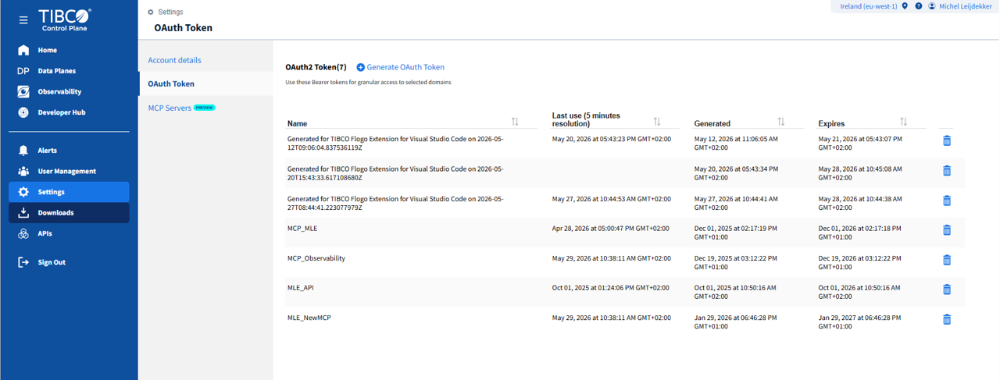

When all information is collected, the Connection information can be entered and a selection of available MCP tools can be made. In our scenario we selected all available tools to participate.
 
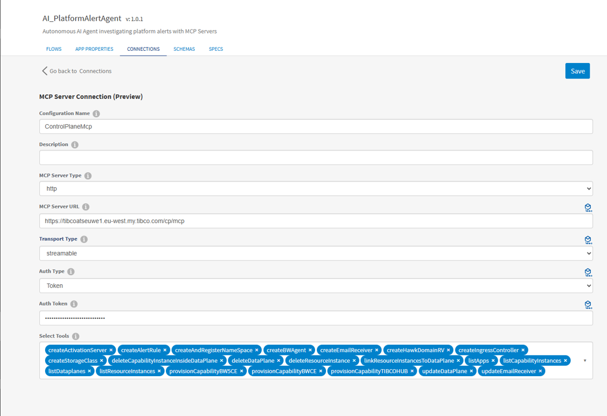

#### Webhook Trigger 

The Webhook trigger is used to receive the alert message from the TIBCO Platform Alert Manager.
The trigger is based on a HTTP Trigger activity in Flogo with a specific context path defined. In our scenario that is defined as: **/alerts/flogo**

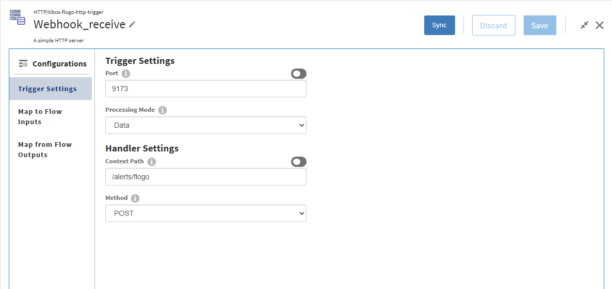

The input definition is based on the TIBCO Platform alert schema that can be found in the [Webhook documentation](https://docs.tibco.com/pub/platform-cp/1.17.0/doc/html/Default.htm#UserGuide/configuring-webhook-receiver.htm?TocPath=Monitoring%257CAlerts%2520and%2520Notifications%257C_____2). 

#### AI Agentic Activity


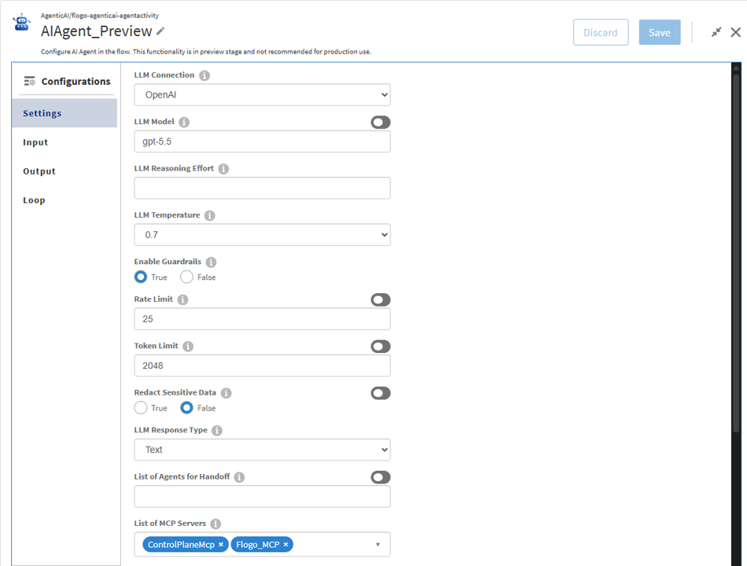

The actual instructions for the AI Agent to perform its job, are mapped into the user prompt entry in the Activity Input data. This user prompt corresponds to the 6-step instruction that is described in the introduction of this article.

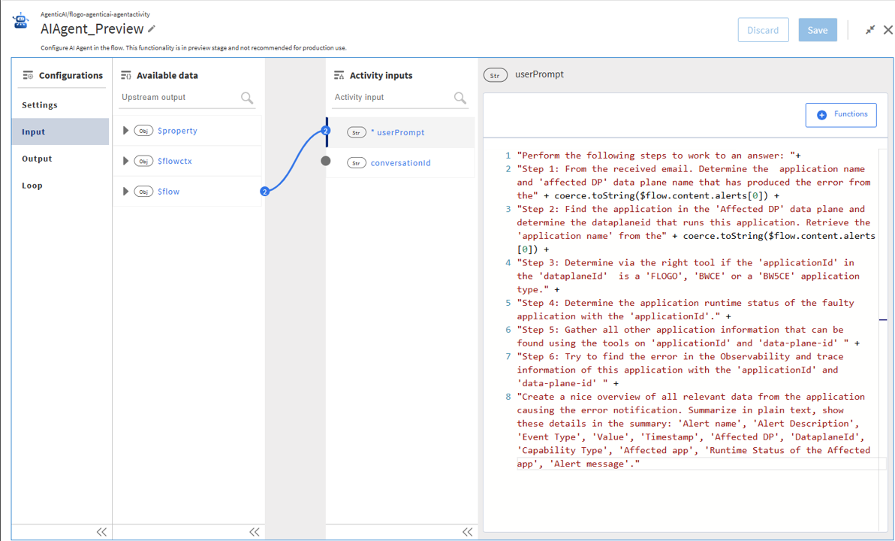

#### Result considerations

In this AI Platform Alert Agent the result of the AI investigation of the error alert is shared via a Log Message in the Flogo Log. This was chosen deliberate to keep the scenario simple and comprehensive.

This is an arbitrary design decision. The gathered information from the MCP Servers can also be used to triage the alerts and determine proper next actions based on the extra information found.

Since the AI Agent runs in the Flogo context any activity of call can be made to take the proper action for a specific platform alert message.

### Deployment of the AI Agent.

The AI Agent can run as a local Flogo Application in your VS Code environment as well as in the TIBCO Platform 1.17 onwards releases. When the local environment option is used, the AI Agent can be triggered by sending the event data manually via a REST Client.

For deploying the Agent into the TIBCO platform, you need to make sure that the Webhook trigger is visible outside the data plane. In order to do that the endpoint visibility should be altered from private to public.
#### TIBCO Platform: set the endpoint visibility to public

After deployment in TIBCO Platform, you have to change the endpoint visibility to public, so the Webhook trigger of the AI Agent can be called by the TIBCO Platform Alert Manager.

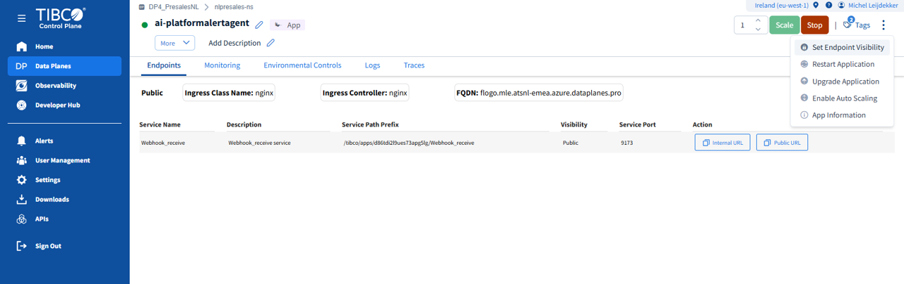

>Note: After changing the endpoint visibility make sure to update the Alert Receiver definition in the TIBCO Control Plane. The Alert Manager will try to push the alert message towards the AI Agent endpoint, including the context path definition.

### Running the scenario

#### Running using the Platform event trigger

In order to create an error event for testing, I created a simple Flogo Application to trigger errors.
This Flogo sample application is also available under the source directory in the GIT repository.
When the alert rule is evaluated to true, the error alert will be sent by the TIBCO platform to the configured alert receiver.


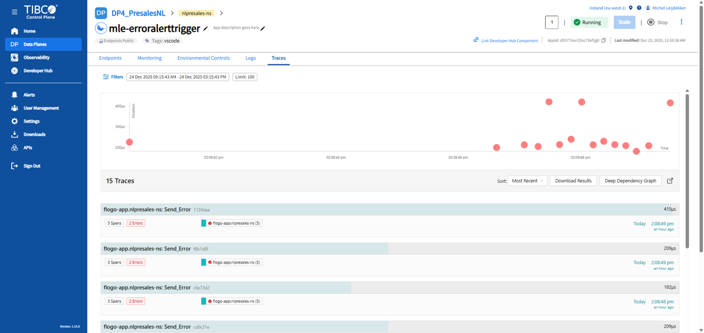

>Note: Running this ErrorAlertTrigger sample can interfere with the other applications in your data plane. When you want to test intensively with Alert Triggers and the AI Agent or if you want to unit test the AI Agent application, you can use the manual trigger solution described below.

#### Manual trigger

Alternatively the scenario can also be triggered manually, by sending the following payload over the Webhook HTTP Trigger. A REST POST command on the Webhook Trigger URL from the FLOGO Agent Flow will do the trick and get the Agent to work for you. 

```
{
  "version": "1.0",
  "subscriptionId": "d6febsjgd6fc73ejkof0",
  "region": "us-west-2",
  "alertCount": 1,
  "truncated": false,
  "alerts": [
    {
      "status": "firing",
      "labels": {
        "app_id": "d5577mu7j5sc73efljg0",
        "app_name": "mle-erroralerttrigger",
        "app_namespace": "nlpresales-ns",
        "app_type": "flogo",
        "app_version": "1.0.0",
        "k8s_pod_name": "",
        "k8s_pod_start_time": "",
        "workload_type": "user-app",
        "x_tibco_rule_id": "d555lkial6jc73bkiu60"
      },
      "severity": "Critical",
      "alertName": "Flogo_Error_Alert",
      "alertDescription": "Flogo Errors via Email",
      "timestamp": "2026-05-20T12:00:00Z",
      "eventType": "RequestFaults",
      "alertRule": "FaultPercentage >= 1% (1m)",
      "value": "100",
      "affectedDP": "cq1duk2jcp26pefl1d60",
      "alertMessage": "Flogo Error Alert: Error Occurred",
      "cpSubscriptionURL": "https://tibcoatseuwe1.eu-west.my.tibco.com/"
    }
  ]
}
```


#### Example Output message

**Output from the Log_AgentResult activity:**


```
[flogo.general.activity.log] -	Email Received## Faulty Application Overview

**Alert name:** Flogo_Error_Alert_WebHook  
**Alert Description:** Flogo Errors via Email  
**Event Type:** FaultPercentage  
**Value:** 100  
**Timestamp:** 2026-05-28T09:07:16Z  
**Affected DP:** DP4_PresalesNL  
**DataplaneId:** cq1duk2jcp26pefl1d60  
**Capability Type:** FLOGO  
**Affected app:** mle-erroralerttrigger  
**Runtime Status of the Affected app:** Running  
**Alert message:** Flogo Error Alert: Error Occurred  

---

## Findings

The email alert reported a **Critical** Flogo fault percentage alert on data plane **DP4_PresalesNL**.

From the alert payload:

- **Data plane name:** DP4_PresalesNL
- **Data plane ID:** cq1duk2jcp26pefl1d60
- **Application ID:** d5577mu7j5sc73efljg0
- **Rule:** FaultPercentage >= 1% over 1 minute
- **Observed value:** 100
- **Status:** firing

Using the application ID and data plane ID, the affected application was found:

- **Application name:** mle-erroralerttrigger
- **Application display/name in Flogo details:** MLE_ErrorAlertTrigger
- **Application ID:** d5577mu7j5sc73efljg0
- **Namespace:** nlpresales-ns
- **Capability:** FLOGO
- **Application state:** Running
- **Instance count:** 1
- **Pod status:** Running

Although the application and pod are currently running, the alert indicates that the application recently produced Flogo runtime faults, with a reported **FaultPercentage value of 100**.

---

## Application Details

**Application ID:** d5577mu7j5sc73efljg0  
**User app name:** mle-erroralerttrigger  
**Flogo app name:** MLE_ErrorAlertTrigger  
**Version:** 1.0.0  
**Description:** App description goes here  
**Namespace:** nlpresales-ns  
**Tags:** vscode, mle  
**Created by:** Michel Leijdekker  
**Modified by:** Michel Leijdekker  

### Runtime / Build

- **Build ID:** b65b13b7370d4aa991650951f0631e36
- **Flogo version:** 2.25.11
- **Base image tag:** 2.25.9-b300
- **Capability version from app details:** 1.13.0
- **Capability instance version from app listing:** 1.14.0
- **Workload type:** deployment
- **Managed by:** flogoprovisioner

### Runtime status

The application is currently reported as:

- **Application state:** Running
- **Pod / instance:** mle-erroralerttrigger-58d459696d-qhwzs
- **Pod IP:** 10.4.0.40
- **Pod status:** Running
- **Namespace:** nlpresales-ns

---

## Capability Details

**Capability type:** FLOGO  
**Capability instance ID:** cq1ekso6c9lo9im24qlg  
**Capability instance name:** FLOGO  
**Capability namespace:** nlpresales-ns  
**Capability status:** provisioned  

Additional Flogo capability information:

- **Capability name:** FLOGO
- **Release version:** 1.17.0
- **Chart version:** 1.17.11
- **Flogo app chart version:** 1.17.14
- **Build version:** 903-platform-1.17.0

### Public Flogo API

- **Public API path:**  
  https://flogo.mle.atsnl-emea.azure.dataplanes.pro/tibco/flogo/presalesnl/

- **Public API Swagger documentation:**  
  https://flogo.mle.atsnl-emea.azure.dataplanes.pro/tibco/flogo/presalesnl/public/dp/docs

---

## Application Endpoint

The application exposes the following service:

- **Service name:** ReceiveHTTPMessage
- **Service description:** ReceiveHTTPMessage service
- **Internal endpoint:**  
  mle-erroralerttrigger.nlpresales-ns.svc.cluster.local:9999

- **Public endpoint:**  
  https://flogo.mle.atsnl-emea.azure.dataplanes.pro/tibco/apps/errorAlertTrigger/ReceiveHTTPMessage

- **Public Swagger UI:**  
  https://flogo.mle.atsnl-emea.azure.dataplanes.pro/tibco/flogo/presalesnl/public/swagger-ui/index.html?url=https%3A%2F%2Fflogo.mle.atsnl-emea.azure.dataplanes.pro%2Ftibco%2Fapps%2FerrorAlertTrigger%2FReceiveHTTPMessage%2Fapi%2Fv2%2Fswagger.json

- **Public Swagger URL:**  
  https://flogo.mle.atsnl-emea.azure.dataplanes.pro/tibco/apps/errorAlertTrigger/ReceiveHTTPMessage/api/v2/swagger.json

- **Port:** 9999
- **Public endpoint enabled:** true
- **Service discovery enabled:** true
- **Ingress controller:** nginx
- **Ingress class:** nginx

---

## Runtime Configuration

### System properties

- **FLOGO_OTEL_TRACE:** true  
- **FLOGO_LOG_LEVEL:** ERROR  

This means OpenTelemetry tracing appears to be enabled for the app, and the application log level is configured to capture errors.

### Resource limits

**Requests:**

- CPU: 250m
- Memory: 512Mi

**Limits:**

- CPU: 500m
- Memory: 1Gi

### Scaling

- **Autoscaling enabled:** false
- **Service mesh enabled:** false
- **Execution history enabled:** false

Because execution history is disabled, detailed execution history may not be available through the Flogo capability.

---

## Observability / Trace Investigation

I could not directly query Observability or trace records because no Observability or trace search tool is available in the current toolset.

However, the application configuration shows:

- **FLOGO_OTEL_TRACE = true**
- **FLOGO_LOG_LEVEL = ERROR**

So the application is configured to emit trace data and error-level logs. The next recommended investigation step would be to search Observability logs/traces for:

- **Application ID:** d5577mu7j5sc73efljg0
- **Application name:** mle-erroralerttrigger
- **Namespace:** nlpresales-ns
- **Data plane ID:** cq1duk2jcp26pefl1d60
- **Pod name:** mle-erroralerttrigger-58d459696d-qhwzs
- **Timestamp around:** 2026-05-28T09:07:16Z
- **Event type:** FaultPercentage
- **Severity:** Critical

---

## Plain Text Summary

A critical Flogo error alert was triggered for application **mle-erroralerttrigger** running on data plane **DP4_PresalesNL**. The alert rule was **FaultPercentage >= 1% over 1 minute**, and the reported value was **100**, meaning the application experienced a very high percentage of faulty executions during the alert window.

The affected application was identified using the application ID **d5577mu7j5sc73efljg0** from the alert. It is a **FLOGO** application running in namespace **nlpresales-ns** on data plane **cq1duk2jcp26pefl1d60**. The current application runtime status is **Running**, and its pod instance is also **Running**.

The application exposes a public endpoint at:

https://flogo.mle.atsnl-emea.azure.dataplanes.pro/tibco/apps/errorAlertTrigger/ReceiveHTTPMessage

Although the app is currently running, the alert indicates it produced runtime faults. OpenTelemetry tracing is enabled, and log level is set to ERROR, but execution history is disabled. Further analysis should be performed in Observability using the application ID, pod name, namespace, and alert timestamp.
```


