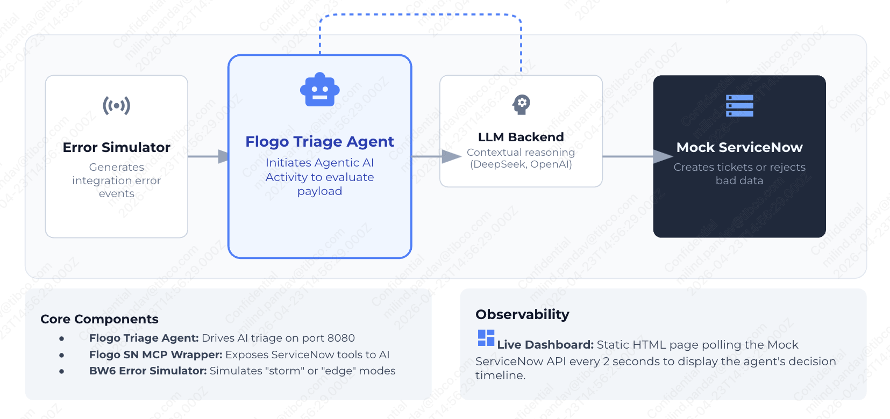
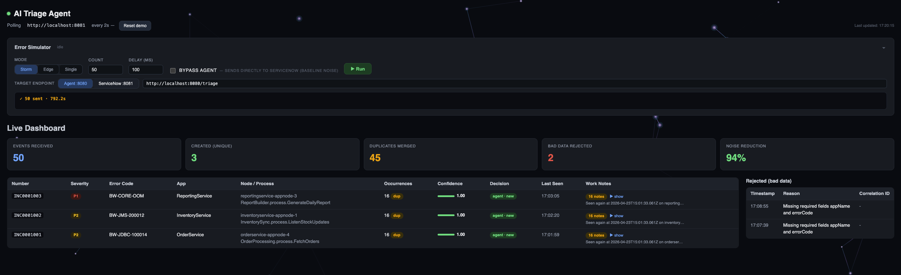

# AI-Powered Incident Triage with Flogo Agentic AI

> **Stop drowning in duplicate tickets.** A Flogo AI Agent watches your integration error stream, reasons about each event, and cuts ServiceNow ticket noise by ~90% — automatically.

---

## 🎯 What This Demo Shows

Enterprises running integration middleware on Kubernetes face a daily problem: every process fault — JDBC timeout, JMS reconnect loop, REST 5xx, out-of-memory — becomes a ServiceNow ticket. On a bad day that's 500+ tickets, ~80% of them duplicates of the same 3–5 root causes.

This demo shows how a **Flogo Agentic AI flow** solves that in real time:

| Without Agent | With Agent |
|---|---|
| 50 events → **50 tickets** | 50 events → **3 tickets** |
| Engineers triage noise all day | Engineers see only unique, actionable incidents |
| Duplicates pile up unlinked | Duplicates merged with occurrence count + audit trail |

---

## 🎬 Demo Scenario

### The Problem
An integration middleware deployment fires 50 error events in 30 seconds — JDBC timeouts, JMS reconnects, REST failures. Without intelligence, each becomes a ServiceNow ticket. The on-call queue explodes.

### The AI-Powered Solution
The same 50 events, now routed through the Flogo AI Agent:

1. **Validate** — malformed events (missing `errorCode`, `appName`) are rejected immediately
2. **Search** — agent queries open incidents from the last 60 minutes via MCP tools
3. **Reason** — the LLM evaluates semantic similarity (not just string matching) and returns a structured decision:
   ```json
   { "decision": "DUPLICATE_OF", "ticketId": "INC0001001", "confidence": 0.92,
     "reason": "Same BW-JDBC-100014 on OrderService, 15 occurrences in last 4 min" }
   ```
4. **Act** — agent calls the right tool: `create_incident`, `append_occurrence`, or `reject_bad_data`
5. **Recommend** — for every new unique incident, the agent searches past resolved tickets for the same error code, synthesises a resolution recommendation (likely cause, remediation steps, estimated effort), and attaches it directly to the ticket — visible in the dashboard drawer the moment the incident is created

### The Edge Cases (What Makes It Interesting)
- **Same error, different app** — `BW-JDBC-100014` on `OrderService` vs `PaymentService` are correctly treated as **two separate incidents**. A rule engine would merge them.
- **Low-confidence guardrail** — when the agent is not sure (confidence < 0.75), it opens a new ticket *and* leaves a "possible duplicate of INCxxxxx" note. SLA protected, human notified.
- **Bad data** — empty payloads and garbage events are rejected cleanly, not silently dropped.

---

## 🏗️ How It Works


```
Integration Error Event
      |
      v
+-------------------------+
|  Flogo Triage Agent     |  POST /triage  (port 8080)
|                         |
|  1. Validate payload    |
|  2. AgenticAI Activity  |<---> Ollama / OpenAI / Azure OpenAI
|     + MCP Tools         |
|       |- search_incidents          |
|       |- create_incident           |<---> Mock ServiceNow  (port 8081)
|       |- append_occurrence         |
|       |- reject_bad_data           |
|       |- search_past_resolutions   |
|       +- update_incident_resolution|
|  3. Return decision JSON |
+-------------------------+
```

## Technical Architecture


## 🎬 Demo Video
```
coming soon...
```

### Components

| Component | Location | Role |
|---|---|---|
| **Triage Agent** | `flogo-apps/ticket-triage-agent.flogo` | Core AI reasoning flow |
| **MCP Wrapper** | `flogo-apps/sn-mcp-wrapper.flogo` | Exposes ServiceNow as MCP tools |
| **Mock ServiceNow** | `mock-servicenow/` | Local REST API (incident store) |
| **Error Simulator** | `bw6-error-simulator/` | Generates realistic integration error events |
| **Live Dashboard** | `dashboard/index.html` | Real-time view of decisions |

---

## 🚀 Running the Demo

### Prerequisites

- **Node.js** v18 or higher
- **Ollama** running locally with `llama3` or `deepseek-v3.1:671b-cloud` pulled
  *(or set `OPENAI_API_KEY` / `AZURE_OPENAI_*` env vars for cloud LLMs)*
- Pre-built binaries are included in `bin/` — no Go or Flogo CLI needed

### Step 1 — Install dependencies (once)

```bash
cd mock-servicenow && npm install && cd ..
cd bw6-error-simulator && npm install && cd ..
```

### Step 2 — Start the services

Open **three terminals**:

**Terminal 1 — Mock ServiceNow**
```bash
cd mock-servicenow
npm start
# Listening on http://localhost:8081
```

**Terminal 2 — MCP Wrapper (ServiceNow tools)**
```bash
./bin/sn-mcp-wrapper
# MCP server ready on http://localhost:8082
```

**Terminal 3 — Triage Agent**
```bash
./bin/ticket-triage-agent
# Triage endpoint ready on http://localhost:8080/triage
```

### Step 3 — Open the dashboard

```bash
open dashboard/index.html
```

The dashboard polls `http://localhost:8081` every 2 seconds and shows live stats and every incident decision.

---

## 📊 Live Dashboard & Simulator
`dashboard/index.html` is a single self-contained file — open it in any browser. It does everything: runs the simulator, streams results live, and displays the full incident table. No extra tooling required once the three services are running.




### Error Simulator panel

The top section of the dashboard is a built-in simulator control panel. You never need to open a separate terminal for demo runs.


| Control | What it does |
|---|---|
| **Storm** mode | Blasts N events with heavy duplication — proves noise reduction |
| **Edge** mode | Sends 7 carefully scripted events that cover every decision path |
| **Single** mode | Fires N random individual events |
| **Count / Delay** | Tune volume and pacing |
| **Bypass agent** checkbox | Routes events straight to ServiceNow (baseline noise, no AI) |
| **Target endpoint** presets | Switch between `Agent :8080` and `ServiceNow :8081` in one click |
| **Run / Stop** | Start a run; stop mid-flight if needed |
| **Live log** | Compact progress bar `████░░ 62% · 31/50 sent` with a final summary line |
| **Auto-collapse** | Panel collapses automatically ~1s after a run finishes so the incident table comes into view |

Click the panel header at any time to manually collapse or expand it.

### Incident table


| Column | What it shows |
|---|---|
| **Severity** | P1 – P4 label (resolved from error code if not provided) |
| **Incident / App** | ServiceNow INC number + app name |
| **Error Code** | Integration error code |
| **Occurrences** | How many events were merged into this ticket |
| **Decision** | Colour-coded pill: `agent·new` (green), `agent·low-conf` (amber), `bypass·baseline` (blue) |
| **Confidence** | Number + colour bar: green ≥ 0.85, amber 0.75–0.84, red < 0.75 |
| **Opened** | Relative timestamp |
| **Work notes** | Click any row to expand the agent's full reasoning and audit trail |
| **AI Resolution Recommendation** | Shown in the incident detail drawer for new incidents — likely cause, step-by-step remediation, effort estimate, and whether it's grounded in a past fix |

Stats cards at the top update every 2 seconds: **Events received**, **Created (unique)**, **Duplicates merged**, **Bad data rejected**, **Noise reduction %**.

---

## 🧠 AI Resolution Recommendation

When the agent creates a **new unique incident**, it doesn't stop at filing the ticket. It immediately:

1. **Searches past resolutions** — queries closed/resolved incidents for the same error code to find what actually worked before
2. **Synthesises a recommendation** — the LLM composes a structured suggestion: likely root cause, step-by-step remediation actions, a runbook reference, and estimated effort
3. **Attaches it to the ticket** — the recommendation is persisted on the ServiceNow record and surfaced instantly in the dashboard incident drawer

### Business value

Traditional operations workflows require the on-call engineer to:

- Open the ServiceNow portal and read the ticket
- Search the knowledge base or runbook wiki manually
- Grep Confluence / Slack history for what fixed this last time
- Escalate if they don't know the system

**With AI Resolution Recommendations the first responder opens the incident drawer and immediately sees:**

| What they see | What it replaces |
|---|---|
| Likely root cause in plain English | Digging through stack traces |
| Step-by-step remediation actions to try first | Hunting runbooks and wikis |
| Estimated resolution effort (e.g. "15–30 min") | Gut feel / escalation |
| "Based on past fix" badge when grounded in history | Slack archaeology |
| AI disclaimer — sets correct expectations | Blind trust in automation |

No extra browser tabs. No portal searches. The engineer can start acting in seconds, not minutes.

### Example recommendation (rendered in drawer)

```json
{
  "likely_cause": "JDBC connection pool exhausted — upstream query holding connections open past timeout",
  "recommended_steps": [
    "Check connection pool metrics in the integration middleware admin console",
    "Identify and kill long-running queries in the database",
    "Restart the OrderService integration process agent if pool does not recover",
    "Consider increasing pool size from 10 to 20 as a short-term fix"
  ],
  "runbook_ref": "https://wiki.internal/integration/jdbc-pool-exhaustion",
  "estimated_effort": "15–30 min",
  "based_on_past_fix": true,
  "disclaimer": "AI-generated suggestion. Always validate against current environment state."
}
```

*Visible in the incident detail drawer under **AI Resolution Recommendation** for every new unique incident.*

---

## 🎮 Running the Scenarios

### From the dashboard (recommended for demos)

1. Open `dashboard/index.html`
2. Use the **Error Simulator** panel — no terminal needed
3. Click **Reset demo** in the page header between runs

### Scenario A — The noise problem (baseline)

**Goal:** show the raw ticket flood before the agent.

In the simulator panel:
- Mode: **Storm** · Count: `50` · Delay: `50ms`
- Check **Bypass agent**
- Click **Run**

Watch the dashboard: **50 tickets in ~30 seconds**. This is the customer's daily pain.

</br></br>


Or from the terminal:
```bash
node bw6-error-simulator/simulator.js --mode=storm --count=50 --delayMs=50 --bypass
```

Reset:
```bash
curl -X POST http://localhost:8081/api/now/reset
```

### Scenario B — AI triage in action

**Goal:** same volume, fraction of the tickets.

- Mode: **Storm** · Count: `50` · Delay: `100ms`
- **Uncheck** Bypass agent · Target: `Agent :8080`
- Click **Run**

Expected result:

| Metric | Value |
|---|---|
| Events received | 50 |
| Unique incidents created | ~3 |
| Duplicates merged | ~45 |
| Bad data rejected | 2 |
| **Noise reduction** | **~94%** |


Expand any incident row to read the agent's work notes and confidence score.

### Scenario C — Edge cases

**Goal:** show the cases rule engines get wrong.

- Mode: **Edge** · Count: `7`
- Click **Run**

What to watch:

| Event | Decision | Why it matters |
|---|---|---|
| Event 2 — FraudScreening | **agent·low-conf** (red bar) | Same app + same error code, different downstream service — agent opens new ticket and warns on the original |
| Event 5 — JDBC on PaymentService | **agent·new** | Same error code as OrderService already in store, but different app = separate incident. Rule engines merge these. |
| Event 7 — empty payload | **BAD_DATA** | Rejected cleanly; never touches the incident queue |


---

## 🔧 Troubleshooting

| Symptom | Fix |
|---|---|
| Dashboard shows no data | Run `curl http://localhost:8081/health` — mock ServiceNow must be running |
| Agent returns errors | Check terminal 3 logs; verify Ollama is running with `ollama list` |
| Port conflict | Set `PORT=808x` env var before starting each service |
| All confidence scores = 1 | Ollama model may be too small — try `llama3:8b` or `mistral`  We used `deepseek-v3.1:671b-cloud`

---

## 🔁 Resetting Between Runs

```bash
curl -X POST http://localhost:8081/api/now/reset
```

Or click **Reset demo** in the dashboard header.

---

## 📖 Deep Dive

For a full technical walkthrough — including how the system prompt is structured, why edge cases need pre-seeding, and what the noise-reduction math looks like — read [BLOG.md](BLOG.md).
