# Google Cloud Storage Example


## Description

This example demonstrates how to use Google Cloud Storage (GCS) connector activities with TIBCO Flogo Extension for Visual Studio Code.

The sample app **GCS-CRUD-App** contains a single flow that exercises all 6 GCS activities in sequence — demonstrating a complete lifecycle of bucket and object management in Google Cloud Storage.

The main purpose of these activities is:
* To **Create** a Bucket and an Object using the Create activity.
* To **Upload** a large file into the bucket using the Upload activity.
* To **List** all objects in the bucket using the List activity.
* To **Get** a specific object from the bucket using the Get activity.
* To **Update** object metadata and ACL using the Update activity.
* To **Delete** objects and the bucket using the Delete activity.


## Prerequisites

1. The application is compatible with Flogo Extension for Visual Studio Code version 2.26.4+.

2. You must have a Google Cloud Platform (GCP) account with an active project.

3. Create a **Service Account** in your GCP project and download its **JSON key file**. The service account must have the following IAM roles (or equivalent permissions):
   - `Storage Admin` — to create, list, get, update, upload, and delete buckets and objects.

4. Ensure that your Google Cloud Storage bucket name is globally unique. This sample uses `gcsflogo-test-bucket` as the bucket name.

5. For the **Upload** activity, prepare a local file to upload. This sample references a 1 GB binary file. Update the file path in the UploadLargeFile activity to point to a valid local file before running.

6. Install TIBCO Flogo Extension for Visual Studio Code.


## Create Google Cloud Storage Application

1. Install TIBCO Flogo Extension for Visual Studio Code and create a new Flogo app.

2. In the newly created Flogo app, go to **CONNECTIONS > Create Connection > Google Connector**.


3. Configure the Google connection by uploading your **Service Account JSON key file** and clicking **Save** to save the connection.


4. Go to the **FLOWS** tab, add a **Receive HTTP Message** trigger, and configure it.

   - **Method**: GET
   - **Port**: 9999
   - **Path**: /gcs-crud

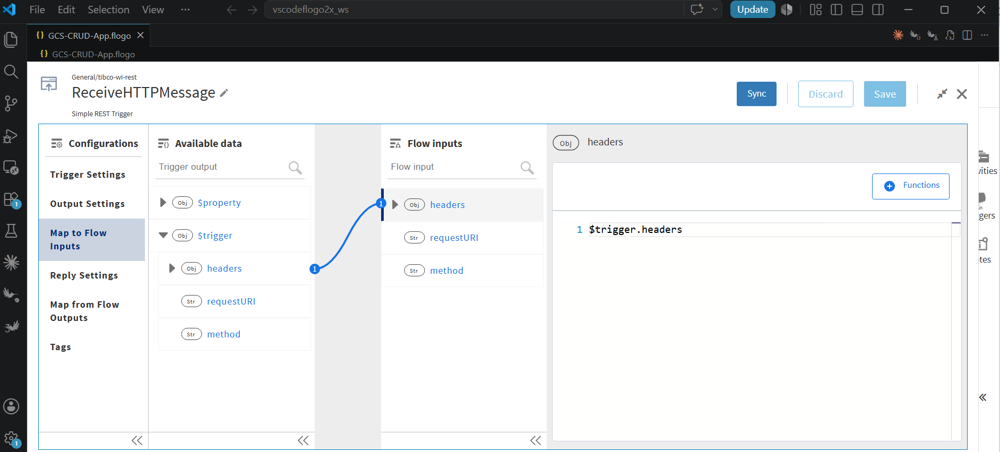
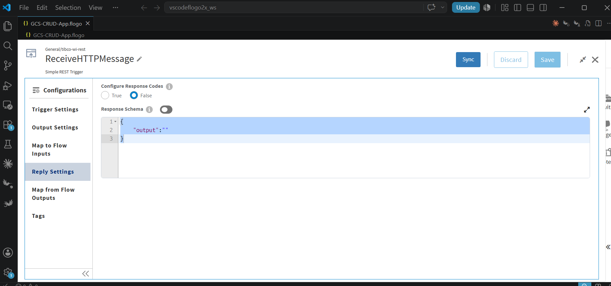
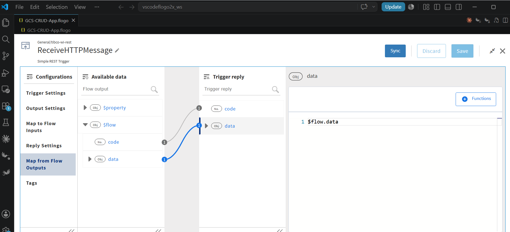

5. Add and configure the **Create** activity for creating a Bucket.

   - **Object Name**: Bucket
   - **Bucket Name**: gcsflogo-test-bucket
   - **Project Name**: your-gcp-project-id
   - **Storage Class**: Standard

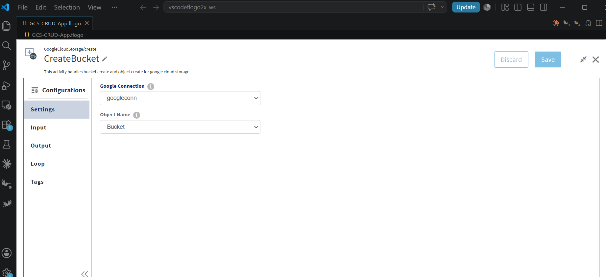
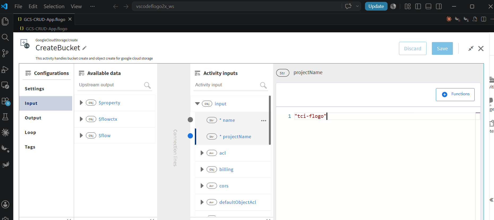

6. Add another **Create** activity for creating an Object inside the bucket.

   - **Object Name**: Object
   - **Bucket**: gcsflogo-test-bucket
   - **Object Name (file)**: testFile1.txt
   - **Upload Type**: multipart
   - **Data**: sample object with dummy data....!!!!
   - **Storage Class**: Standard
   - **Metadata**: uploadedBy:Khushali

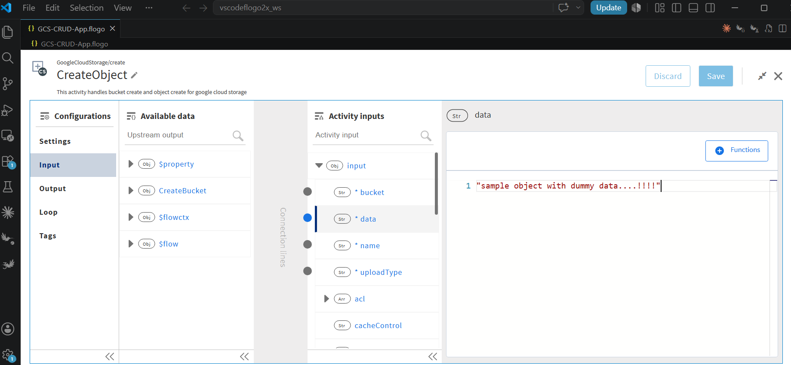

7. Add and configure the **Upload** activity to upload a large local file to GCS.

   - **Bucket Name**: gcsflogo-test-bucket
   - **File Path**: path/to/your/local/file.bin
   - **Object Name**: 1GBFileUploaded
   - **Chunk Size**: 55442266 (bytes)

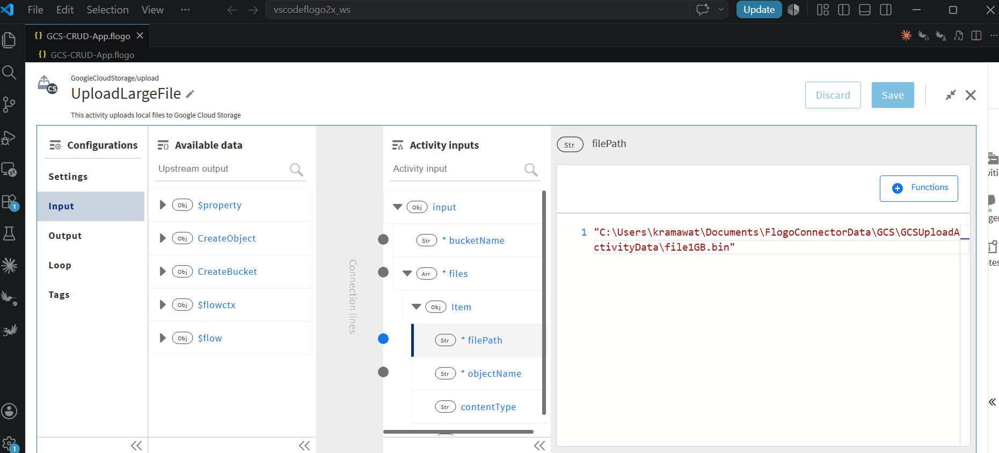

8. Add and configure the **List** activity to list objects in the bucket.

   - **Resource Type**: Object
   - **Bucket**: gcsflogo-test-bucket

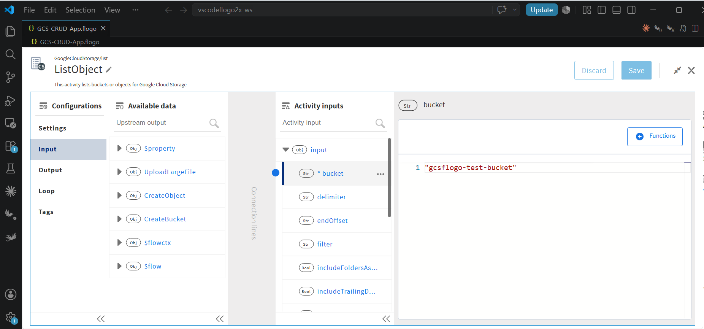

9. Add and configure the **Get** activity to retrieve a specific object.

   - **Object Name**: Object
   - **Bucket**: gcsflogo-test-bucket
   - **Object**: testFile1.txt

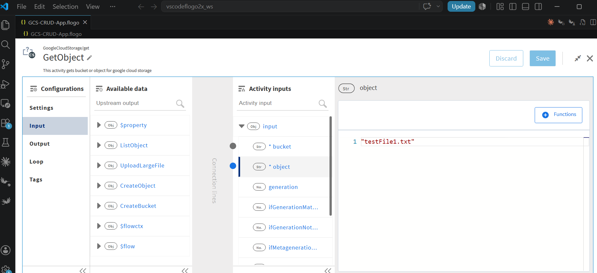

10. Add and configure the **Update** activity to update object metadata and ACL.

    - **Object Name**: Object
    - **Bucket**: gcsflogo-test-bucket
    - **Object**: testFile1.txt
    - **Content Type**: text/csv
    - **Metadata**: updatedBy:Khushali Ramawat, purpose:testing
    - **ACL**: mapped from CreateObject activity output

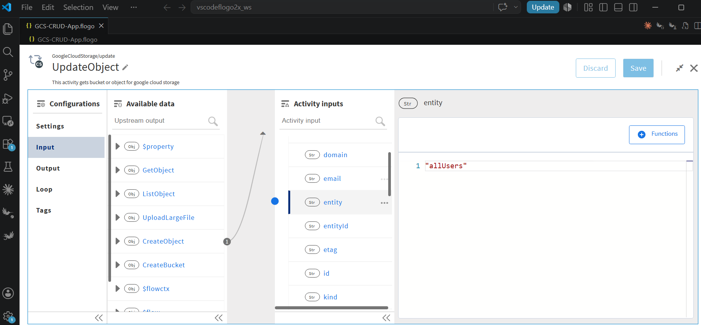

11. Add and configure the **Delete** activity to delete the object, the uploaded file, and finally the bucket.

    - **DeleteObject**: deletes `testFile1.txt` (object name from GetObject output)
    - **DeleteUploadedFile**: deletes `1GBFileUploaded`
    - **DeleteBucket**: deletes `gcsflogo-test-bucket`

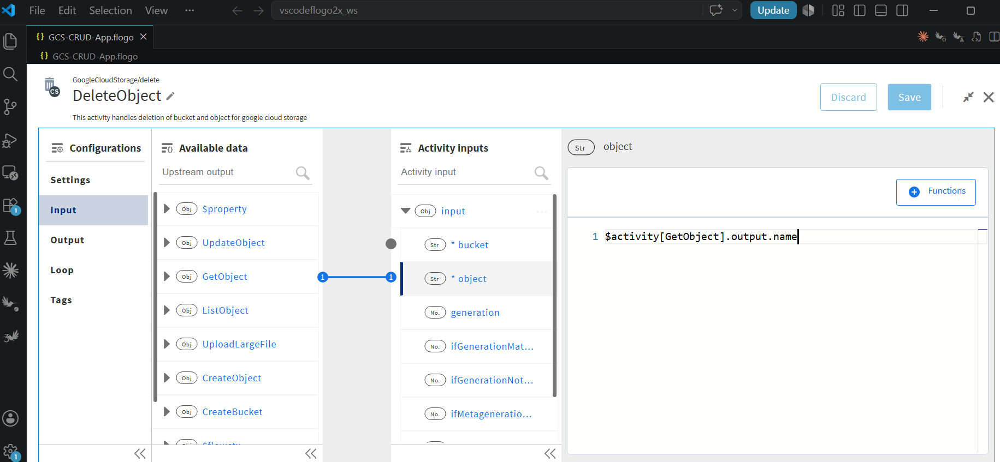
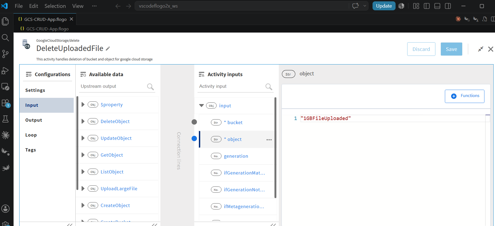
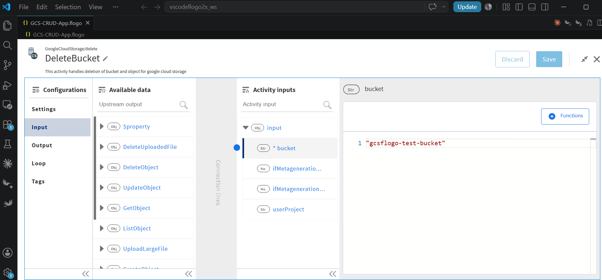

12. Add **Log** activities after each GCS activity to log the output, and add a **Return** activity at the end to return the final result.


## Understanding the Configuration

### The Connection


In the Google Cloud Storage connection, note that:

1. **Service Account Key** — Upload the JSON key file downloaded from your GCP project's Service Account. This key authenticates all GCS API requests made by the Flogo app.
   - The key file is stored as a Base64-encoded property in the app.
   - Connection name used in this sample: `googleconn`


### The Flow

The single flow `GCS_All_Activity_Flow` runs all GCS activities in the following sequence:

```
StartActivity
  → CreateBucket              (Create bucket: gcsflogo-test-bucket)
  → CreateObject              (Create object: testFile1.txt with text content)
  → LogCreateObject           (Log CreateObject output)
  → UploadLargeFile           (Upload large file as: 1GBFileUploaded)
  → LogUploadFile             (Log Upload output)
  → ListObject                (List objects in bucket with prefix: upload/)
  → LogListObject             (Log List output)
  → GetObject                 (Get object: testFile1.txt)
  → LogGetObject              (Log Get output)
  → UpdateObject              (Update metadata, contentType, ACL of testFile1.txt)
  → LogUpdateObject           (Log Update output)
  → DeleteObject              (Delete testFile1.txt using name from GetObject output)
  → DeleteUploadedFile        (Delete 1GBFileUploaded)
  → DeleteBucket              (Delete gcsflogo-test-bucket)
  → LogDeleteObjectFileBucket (Log all Delete outputs)
  → Return                    (Return DeleteBucket output)
```

**Key activity details:**

| Activity | Type | Object | Key Input |
|---|---|---|---|
| CreateBucket | Create | Bucket | name: `gcsflogo-test-bucket`, project: `tci-flogo` |
| CreateObject | Create | Object | bucket: `gcsflogo-test-bucket`, name: `testFile1.txt` |
| UploadLargeFile | Upload | — | bucket: `gcsflogo-test-bucket`, objectName: `1GBFileUploaded` |
| ListObject | List | Object | bucket: `gcsflogo-test-bucket`, prefix: `upload/` |
| GetObject | Get | Object | bucket: `gcsflogo-test-bucket`, object: `testFile1.txt` |
| UpdateObject | Update | Object | metadata, contentType: `text/csv`, ACL from CreateObject |
| DeleteObject | Delete | Object | bucket: `gcsflogo-test-bucket`, object from GetObject |
| DeleteUploadedFile | Delete | Object | bucket: `gcsflogo-test-bucket`, object: `1GBFileUploaded` |
| DeleteBucket | Delete | Bucket | bucket: `gcsflogo-test-bucket` |

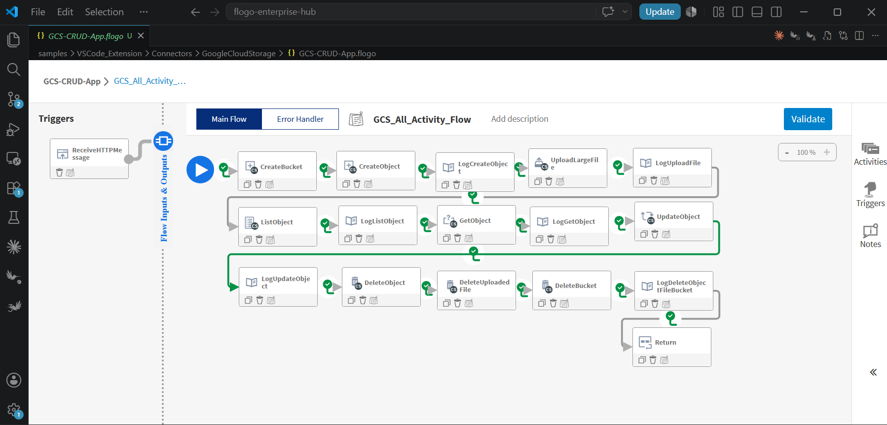

> **Note:** Before running, update the **UploadLargeFile** activity's `filePath` to point to a valid local file on your machine.


## Run the Application

1. Add a local runtime in Visual Studio Code.


2. Select the added local runtime for your GCS Flogo app.

3. Build your GCS Flogo app.

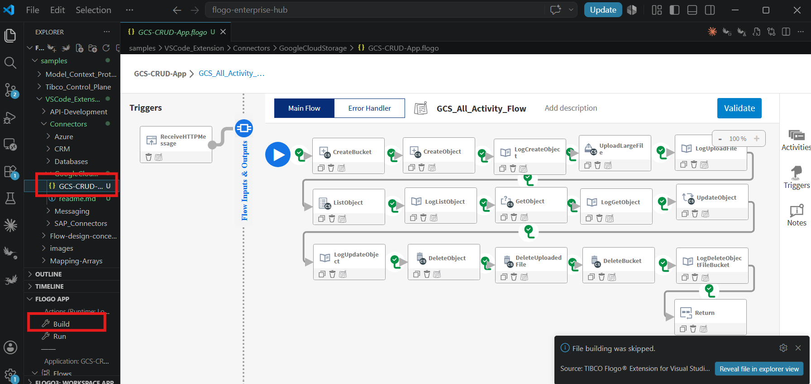

4. Once the build is successful, you can see the binary in the bin folder.

5. Run the GCS Flogo app.

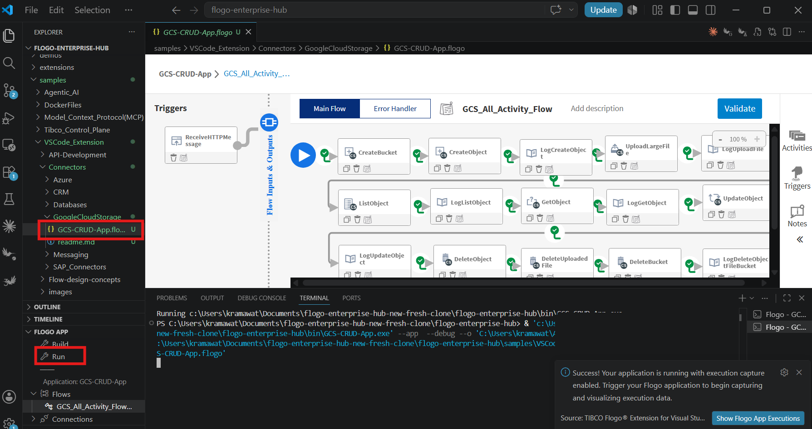


6. Hit the endpoint to trigger the flow:

```bash
curl -X GET http://localhost:9999/gcs-crud
```

7. After hitting the endpoint, you will see the output and logs in the VS Code terminal.


## Outputs

1. Verify the output by hitting the endpoint:

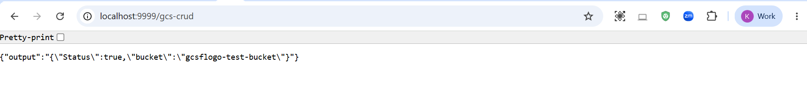

2. Verify the output in the VS Code terminal (Log activity outputs):

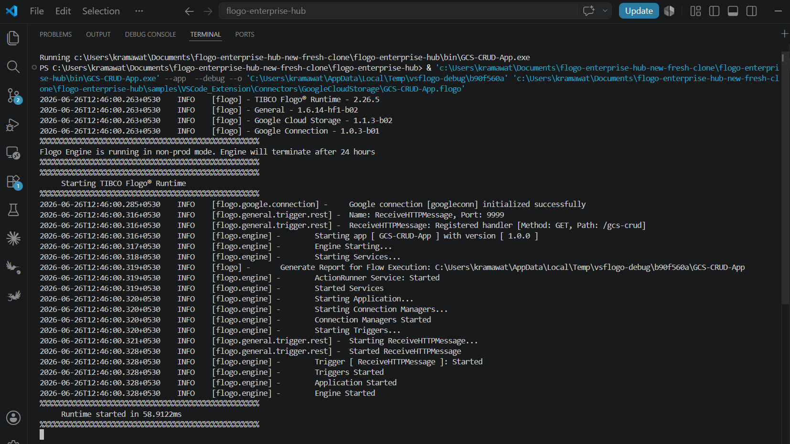
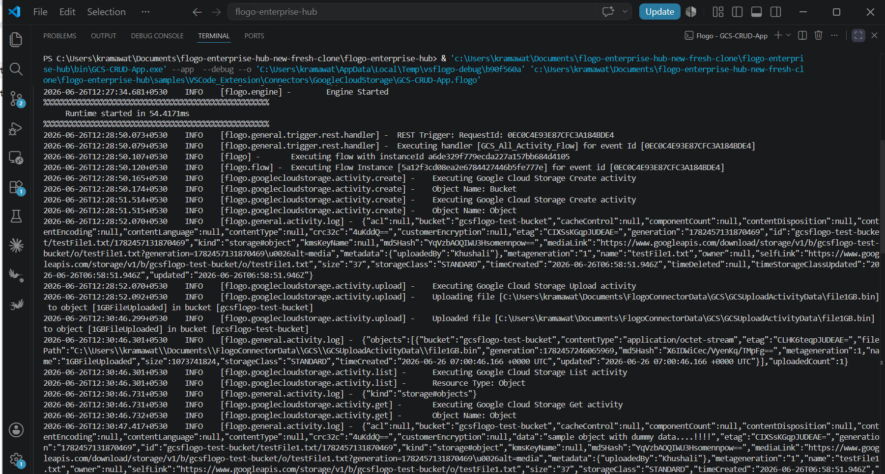
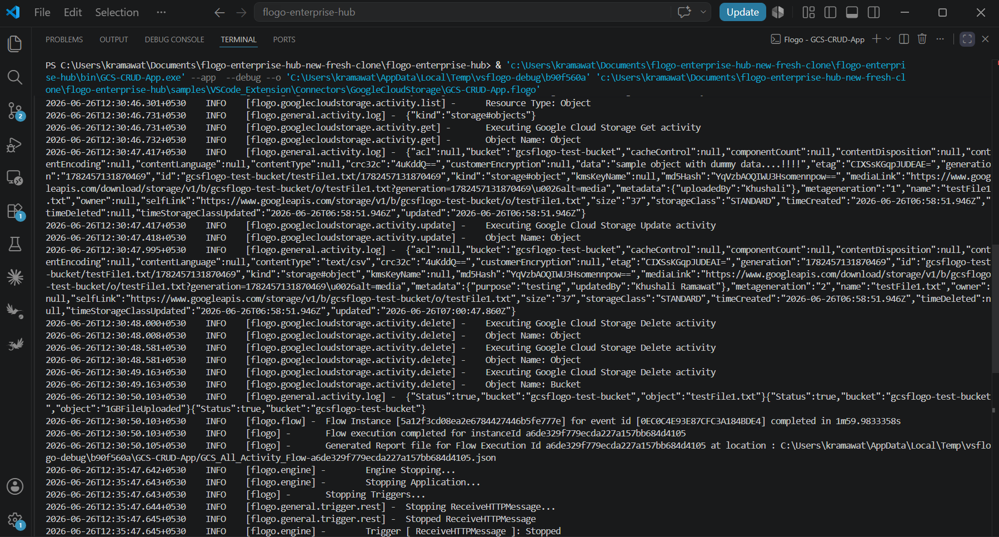


## Troubleshooting

* If you see **"invalid_grant"** or **"Invalid JWT Signature"**, ensure your Service Account key is valid one or has the `Storage Admin` role or sufficient permissions (create, list, get, update, delete) on the GCP project.

* If the **Create Bucket** activity fails, check if the bucket name `gcsflogo-test-bucket` already exists. Update it to a globally unique name in all activities.

* If the **Upload** activity fails, verify that:
  - The local `filePath` in the UploadLargeFile activity is correct and the file exists on your machine.
  - The bucket was successfully created before the upload.

* If you see **"Service Account key file not found"** or connection errors, re-upload the JSON key file in the connection settings and save the connection again.

* If the **List** activity returns empty results, check that the `prefix` parameter matches the actual object name prefix in your bucket.


## Notes and Links

* The Google Cloud Storage connector requires a valid GCP Service Account JSON key for authentication.

* The **Upload** activity supports resumable/chunked uploads for large files. The `chunkSize` parameter controls the upload chunk size in bytes. A larger chunk size reduces the number of API calls but requires more memory.

* The **Create, Update, Delete, Get, List** activities support both Bucket and Object creation, updating, deletion, fetching, and listing. Select the appropriate **Object Name** (`Bucket` or `Object`) in the activity settings.

* The **Update** activity for Objects supports updating metadata, ACL, content type, and other object attributes. The ACL field can be mapped dynamically from a previous activity's output (as shown in this sample — ACL is mapped from the CreateObject output).

* For more information on Google Cloud Storage, refer to the [TIBCO Flogo® Connector for Google Cloud Storage documentation](https://docs.tibco.com/pub/flogo/latest/doc/html/Default.htm#connectors/google-cloud-storage/overview.htm?TocPath=Connectors%2520User%2520Guide%257CSupported%2520Flogo%2520Connectors%257CGoogle%2520Cloud%2520Storage%257C_____0).
