# FTL Example

## Description

This sample demonstrates a publish-subscribe messaging workflow using TIBCO FTL with binary file transfer. The FTL connector provides activities and triggers for publishing and subscribing to messages through an FTL server.

The Publisher flow reads a file as binary content and publishes it to a specified FTL destination whenever the REST endpoint is triggered.
The Subscriber flow has a subscriber trigger that listens to the specified destination, receives the message, logs the content, and writes it to a file.

* Read File: Reads the content of a file in binary format.

* FTL Publisher: Publishes messages to TIBCO FTL destinations (topics/queues).

* FTL Subscriber trigger: Subscribes to messages from an FTL destination. Each message triggers a new flow.

* Write File: Writes the received binary content to a file.

## Prerequisites

* The application is compatible with Flogo Extension for Visual Studio Code version 2.26.2+
* A TIBCO FTL server running and accessible (e.g., https://localhost:8785).
* If your FTL server uses Basic Authentication With TLS, Authentication mTLS, or OAuth2.0 Authentication, ensure you have the required credentials, certificates, and trust files.
* A destination configured in the FTL server administration (e.g., read).
* Depending on the authentication mode and where your FTL server is running, you will need to configure the FTL connection accordingly.
* Ensure that the FTL server is up and running either on your local computer or on a remote server.
* If the FTL server is hosted on a remote instance, make sure your IP is whitelisted or the server is accessible from your network.
* Local runtime configured in Visual Studio Code (for building/running the Flogo app).

## Setting up FTL for Local Runtime

1. Set the `TIBFTL_ROOT` environment variable to point to your TIBCO FTL installation directory.
2. Add the FTL `bin` directory to your system `PATH` variable (e.g., `%TIBFTL_ROOT%\bin` on Windows or `$TIBFTL_ROOT/bin` on Linux).
3. Reload your Visual Studio Code after setting the environment variables for the changes to take effect.

## Open the sample app in VS Code

1. Install the TIBCO Flogo Extension for Visual Studio Code.
2. Download `FTL_PublishSubscribe.flogo` and place it into your Visual Studio Code workspace.
3. Open the file by clicking on it in VS Code.
4. In the app, go to CONNECTIONS > Create Connection > TIBCO FTL.

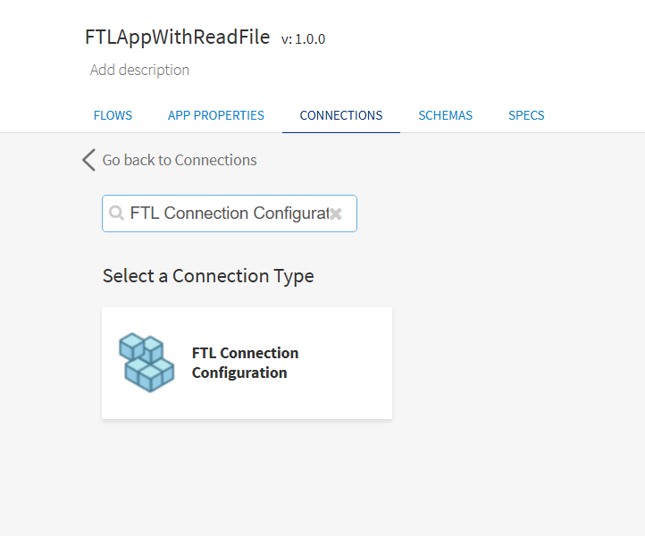

5. Configure the FTL connection details and click Save to save the connection.

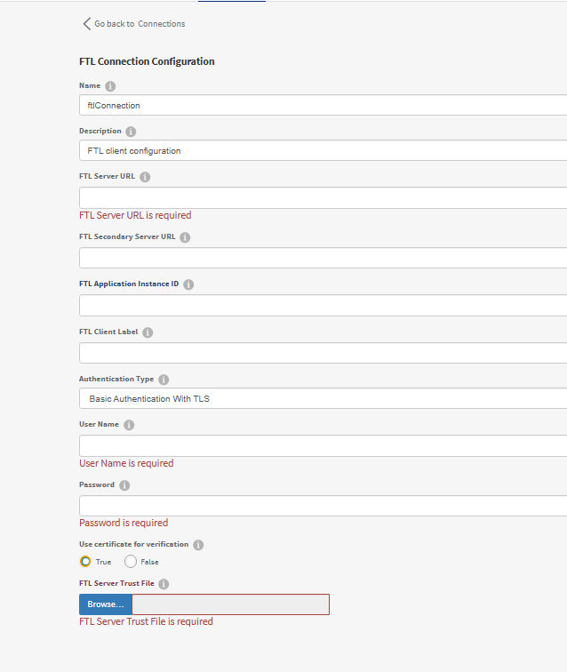

The following details are required to create the FTL connection:

 a. FTL Server URL - The URL of the FTL server (e.g., https://localhost:8785).

 b. FTL Secondary Server URL - The URL of a secondary FTL server for failover (optional).

 c. Application Instance ID - An optional identifier for the application instance.

 d. Client Label - An optional label to identify this client connection.

 e. Authentication Type - Select one of the following authentication types:

    * None: To establish the connection without authentication.

    * Basic Authentication: To use username/password authentication without TLS.

    * Basic Authentication With TLS: To use username/password authentication over TLS.

    * Authentication mTLS: To use mutual TLS (mTLS) with client certificate-based authentication.

    * OAuth2.0 Authentication: To use OAuth2.0 token-based authentication.

 f. User Name - Username for authentication with the FTL server (if required).

 g. Password - Password for authentication with the FTL server (if required).

 h. Use certificate for verification - If set to true, provide a trust certificate (FTL Server Trust File) for server verification. If set to false, certificate verification is bypassed and the TLS connection will not verify the server certificate.

 i. FTL Server Trust File - The CA or server trust certificate file for TLS verification.

 j. Client Certificate - Client certificate for mutual TLS (mTLS) authentication.

 k. Client Private Key - Client private key for mTLS authentication.

 l. Client Private Key Password - Password for the client private key (if encrypted).

 m. OAuth2 Token URL - The token endpoint URL for OAuth2.0 authentication.

 n. OAuth2 Client ID - The client ID for OAuth2.0 authentication.

 o. OAuth2 Client Secret - The client secret for OAuth2.0 authentication.

 p. OAuth2 Server Trust File - The CA or server trust certificate file for the OAuth2.0 token endpoint.

## The Flows

1. If you open the app, you will see there are two flows in the FTL_PublishSubscribe app. The 'Publisher' flow and the 'Subscriber' flow.

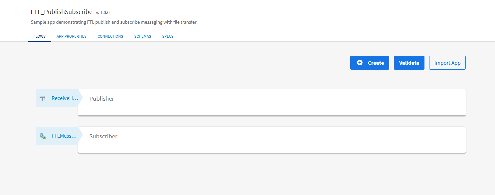

2. The Publisher flow is triggered whenever the REST endpoint `/ftl` (GET) is called. The ReadFile activity reads a file in binary format. The FTLPublisher activity then publishes the binary content to the FTL destination `read` using the Opaque message format with Send Inline policy.

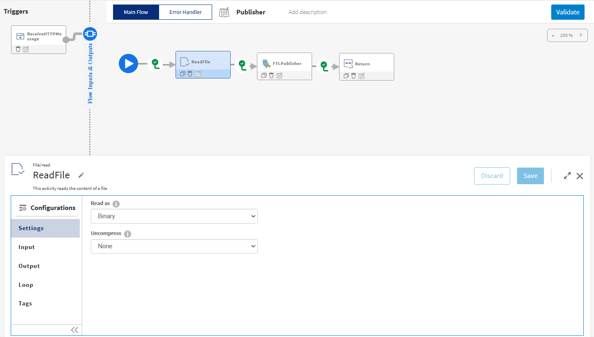

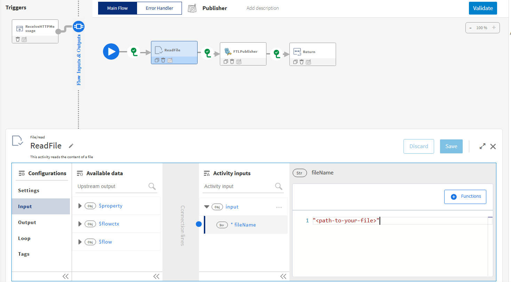

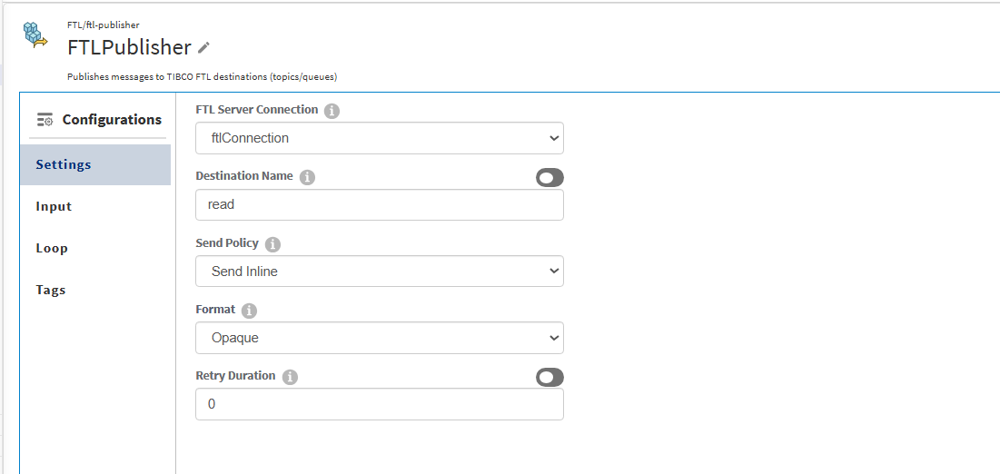

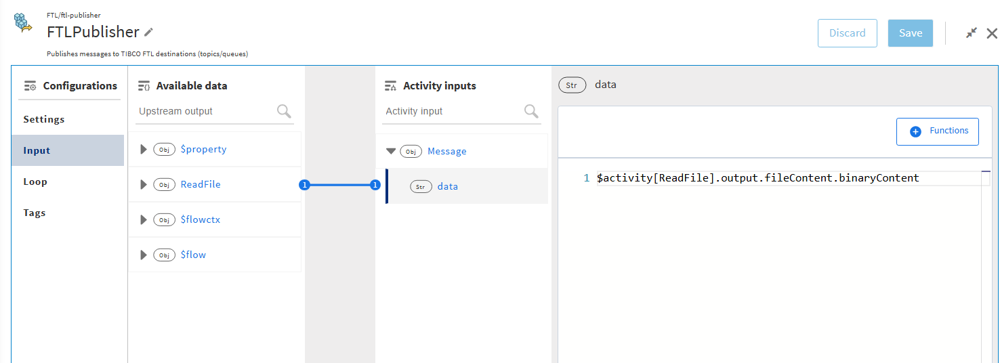

3. The Subscriber flow has the FTL Subscriber trigger which is listening to the destination `read` with a standard durable subscription named `readstandard`. When a message is received, the LogMessage activity logs the message data and the WriteFile activity writes the received binary content to a file.

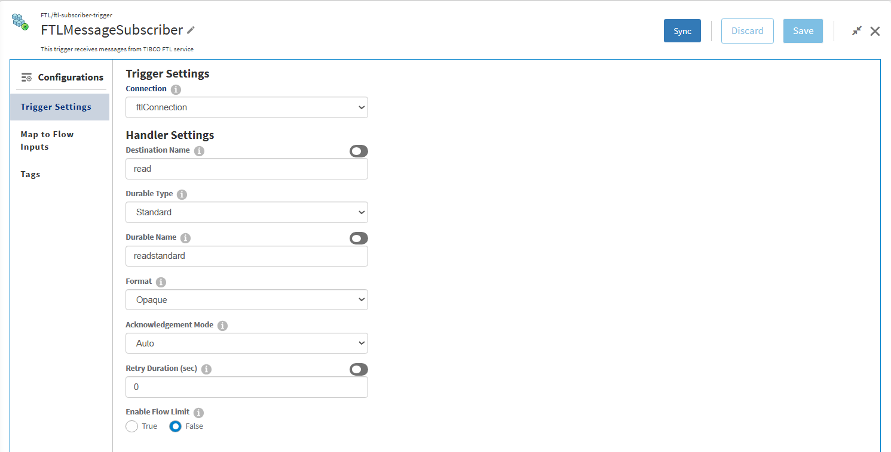

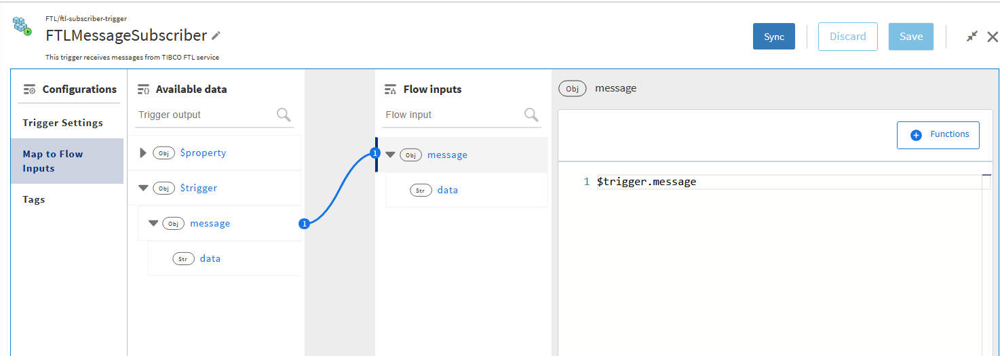

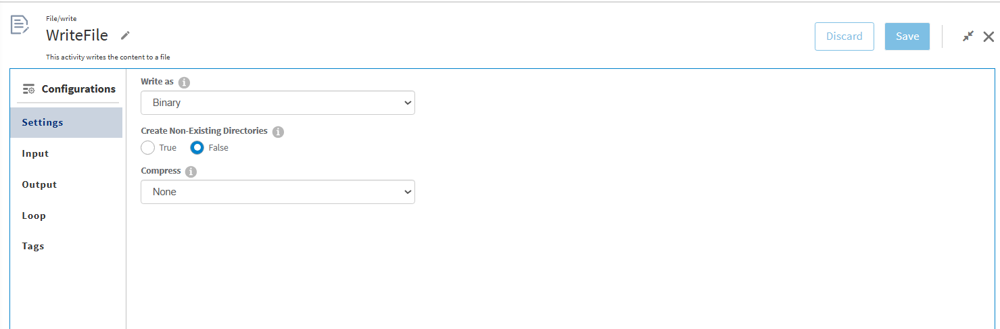

## FTL Message Formats

The FTL connector supports three message formats. You must select the same format for both the Publisher and Subscriber.

* **Custom**: Uses a named format defined in the FTL server administration with typed fields (e.g., strings, integers, floats, datetime). Select this when you need structured messages with a defined schema. You must specify the format name and configure the message schema to match the format defined on the FTL server.

* **Keyed Opaque**: Similar to Opaque, but includes a user-defined key along with the binary payload. The key can be used for message filtering or routing on the subscriber side.

* **Opaque**: Sends raw binary data as the message payload. Best suited for file transfers, serialized objects, or any unstructured binary content. This is the format used in this sample.

## Run the application

Before running, update the file paths in the app:
1. In the Publisher flow, update the ReadFile activity's `fileName` to point to the file you want to send.
2. In the Subscriber flow, update the WriteFile activity's `fileName` to the desired output path.

For running the application,
1. Start by adding a local runtime in Visual Studio Code. Assign a name to the runtime and click the "Save" button.

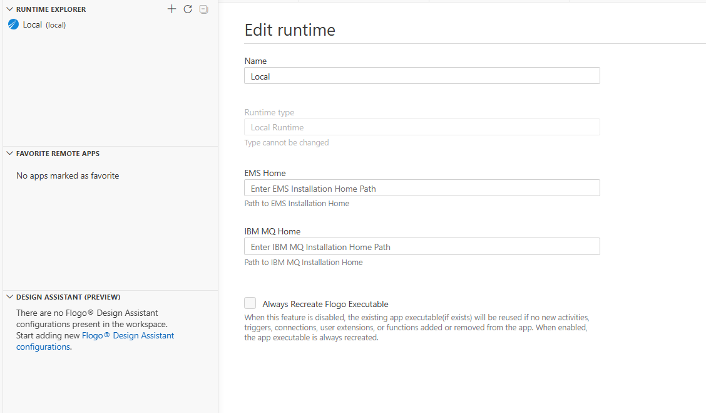

2. Select the local runtime you added for your Flogo FTL app. To do this, click on the FLOGO APP in the explorer, then click "Actions" and select the added Local Runtime.

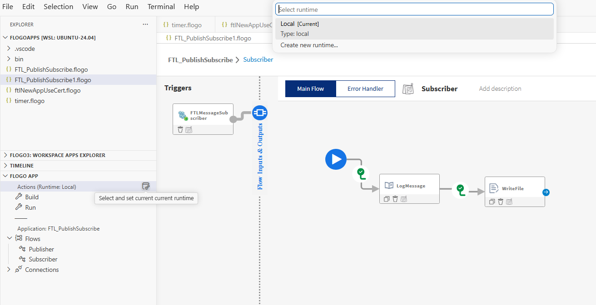

3. Now Build your Flogo FTL app. In the FLOGO APP section, click on "Build".

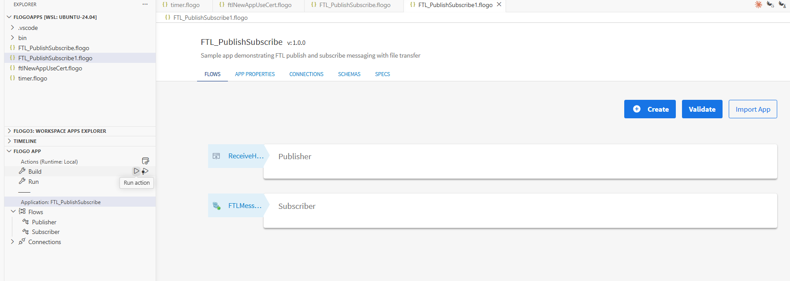

4. Once the build is successful, you can see the binary in bin folder.

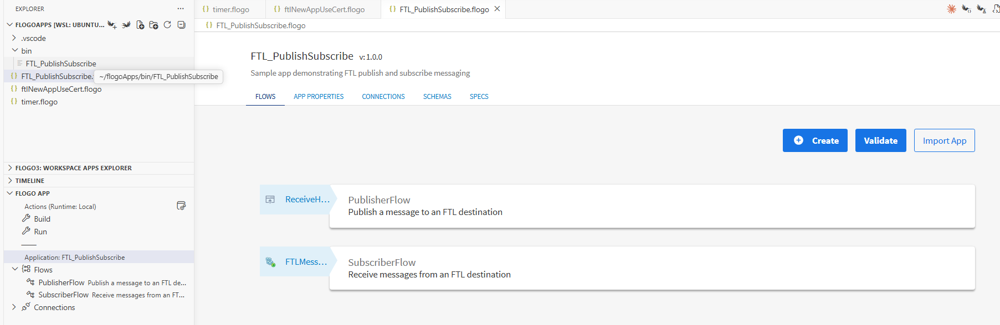

5. Now Run the FTL app.

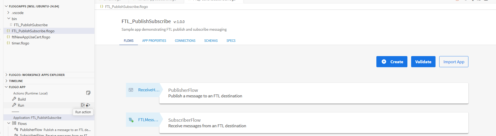

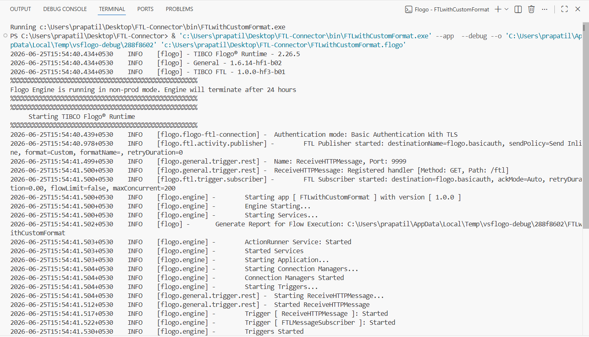

6. After running the app, hit the endpoint `http://localhost:9999/ftl` and see the results.

7. After hitting the endpoint, you will be able to see the logs in VS Code terminal.

## Outputs

1. Verify output by hitting the endpoint

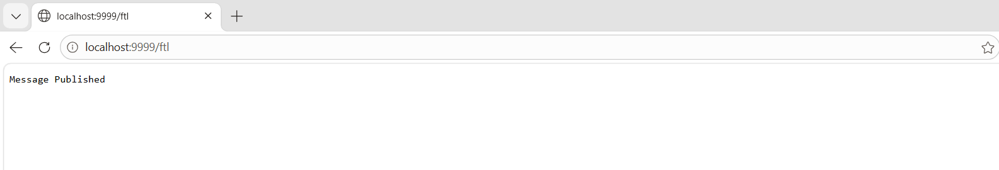

2. Verify output in VS Code terminal

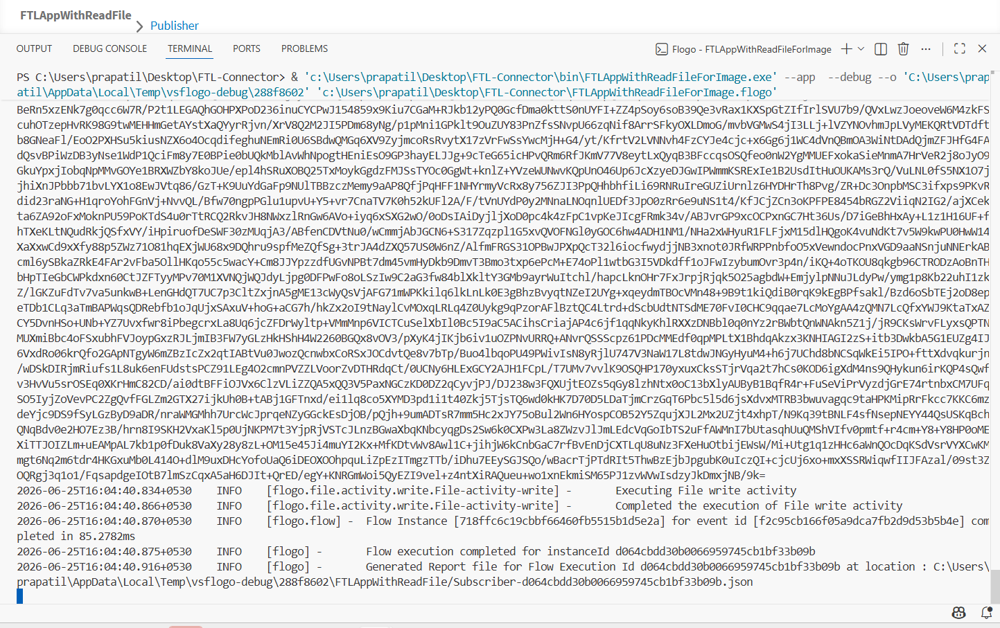

3. Verify the output file is written at the path specified in the WriteFile activity.

## Troubleshooting

* If the FTL server is down or the FTL server URL is incorrect or unreachable:
`warn rscl: Client(_boot) Realm not responding at https://<host>:<port> (Realm server not found: Failed to connect to <host> port <port> after 0 ms: Could not connect to server).`

* If authentication fails:
`ERROR [flogo] - Failed to create engine instance due to error: failed to connect to FTL realm [https://<host>:<port>]: Invalid user name or password`

* If the file path in ReadFile or WriteFile is invalid, ensure the file paths are correct and accessible.

## Help

Please visit our [TIBCO FTL Connector documentation](https://docs.tibco.com/pub/flogo/latest/doc/html/Default.htm#connectors/ftl/ftl_overview.htm?TocPath=Connectors%2520User%2520Guide%257CSupported%2520Flogo%2520Connectors%257CTIBCO%2520FTL%257C_____0) for additional information.
